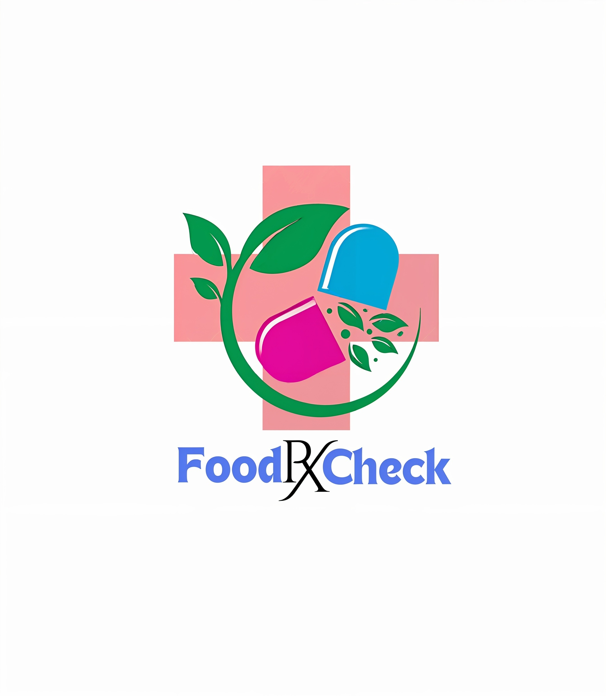

<h1 align="center">🌟 Karunya Manoj Chavan 🌟</h1>
<h4 align="center">PARRAIN</h4>

  
  
  
  

  

---

## 🔥 Featured Projects

### ⚙️ CXL Protocol Simulator (Nov 2024 – Present)  

  

- **Architecture & Goal:** Building a modular C++ simulator that faithfully emulates the CXL 2.0 stack, from link initialization to high-level memory services.  
- **Device Enumeration & BAR Decoding:** Simulated PCIe bus scans, Base Address Register (BAR) mappings, and dynamic discovery of CXL-compliant devices.  
- **Coherency & Protocol Layers:** Implemented cache-coherency state machines, host↔device messaging, and basic memory access flows.  
- **MCTP Integration:** Added Memory Component Transport Protocol support for robust in-band device control and error reporting.  
- **External ROM & Memory Ops:** Modeled ROM fetches for firmware-level initialization and sketched host-managed memory pooling scenarios.  
- **Ongoing Enhancements:** Extending dynamic device hot-plug, advanced MCTP message queues, and validation against Intel/CXL Consortium reference flows.

---

### 🚀 FoodRxCheck (Jan 2025 – Mar 2025)  

  

- **End-to-End Full-Stack:** Developed cross-platform mobile (React Native + Expo) and responsive web (React + Vite) clients.  
- **Backend & Data:** Architected a Supabase (PostgreSQL) backend with row-level security, hosting 500+ curated food–drug interaction records.  
- **Search & Caching:** Engineered full-text search indices and in-memory caches—reduced average lookup latency by 40%.  
- **CI/CD & Deployment:** Containerized services with Docker, automated builds/tests via GitHub Actions, and deployed to a cloud VM cluster.  
- **Production Impact:** Live at Deenanath Mangeshkar Hospital since Apr 2025—empowering HCPs with instant safety alerts.

---

### 📊 Attendance Management System (Apr 2025)  

  

- **MEAN Stack Design:** Built Angular front end with Chart.js visualizations and Node.js/Express APIs.  
- **Authentication & Roles:** Implemented JWT-based auth with three roles (Admin, Teacher, Student), each seeing tailored dashboards.  
- **Data Layer:** Connected to MongoDB Atlas, structured collections for classes, sessions, and attendance logs.  
- **Features & UX:** Dynamic filters, date-range printing/export, and per-class drill-downs—ensured sub-second chart updates on 10k+ records.  
- **Scalability:** Indexed queries, lazy loading, and service-worker caching for offline resilience.

---

### 👁️ Realtime Face-Recognition Attendance (Feb 2024 – Apr 2024)  

  

- **Computer Vision Core:** Leveraged OpenCV for HOG + DNN face detection and LBPH face recognition pipelines.  
- **Excel Automation:** Automated student roster import/export and attendance marking in `.xlsx` via `openpyxl`.  
- **Real-Time Sync:** Persisted logs to Firebase Firestore, enabling live updates across teacher dashboards.  
- **Reliability & UX:** Added retry logic for recognition failures and user prompts—achieved 98% match accuracy in mixed-lighting conditions.

---

## 🛠️ Skills & Tools

  <!-- Programming -->
   
   
   
   
  <!-- OS -->
   
   
  <!-- Web & Mobile -->
   
   
   
  <!-- Backend & DB -->
   
   
   
   
  <!-- DevOps & Cloud -->
   
   
   
   
  <!-- Big Data -->
  
  
   
  <!-- Virtualization & Systems -->
    

---

## 🌐 Connect with Me

  📧 karunyachavan84@outlook.com &nbsp; | &nbsp;
  📞 +91 93592 88942 &nbsp; | &nbsp;
  🔗 <a href="https://linkedin.com/in/karunya-chavan-kc">LinkedIn</a> &nbsp; | &nbsp;
  🔗 <a href="https://github.com/KarunyaChavan">GitHub</a>

